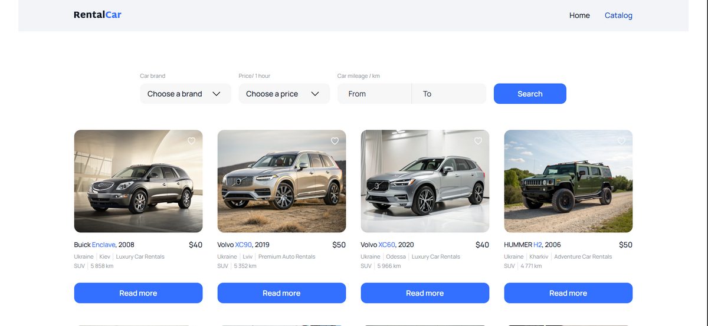

# Auto Room – Smart Rental Solution for the Modern Driver 🚗

🔗 **Live Demo:** [https://auto-room-pied.vercel.app](https://auto-room-pied.vercel.app)



## 🔎 Project Description

**Auto Room** is an innovative car rental web application focused on convenience, performance, and responsiveness. The app allows users to easily search, view, and book cars, as well as save favorites. A modern UI, fast response, and flexible filters make car rental simple and enjoyable.

Built for those who value **time**, **style**, and **comfort**.

---

## 🌟 Core Features

- 🔍 **Instant Search & Filtering**

  - By brand, price, and mileage
  - Real-time results without page reload

- 📄 **Detailed Car Card**

  - High-quality images
  - Technical specifications
  - Additional options

- 📅 **Booking Form**

  - Convenient date picker
  - Data validation before submission
  - Rental confirmation

- ❤️ **Favorites**

  - Add cars to favorites
  - Session-persistent storage

- 🔁 **Smooth Pagination**
  - Load more via "Show More" button

---

## 🧰 Tech Stack

### 🔨 Frontend

- **Vite** – ultra-fast build tool
- **React 19** – UI-building library
- **Redux Toolkit** – state management
- **React Router DOM v7** – routing
- **Axios** – API interaction
- **Redux Persist** – session persistence

### 🎨 UI & UX

- **CSS Modules + modern-normalize** – modular and balanced styles
- **react-select** – custom dropdowns
- **react-datepicker** – easy date selection
- **react-hot-toast** – toast notifications
- **react-spinners** – loading indicators
- **clsx** – conditional classnames

### 🧪 Validation & Forms

- **Formik** – form management
- **Yup** – validation schema

---

## 🚀 Installation & Launch

### 🔧 Requirements:

- Node.js (latest LTS recommended)
- npm or yarn

### 📦 Installation:

```bash
git clone https://github.com/ConstantineKobushka/auto-room
cd auto-room
npm install
npm run dev
```
